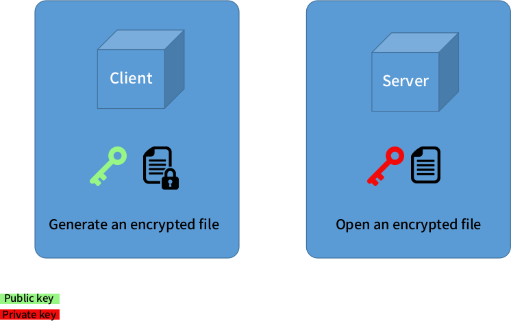

Super secret ansible-vault
==========================

Hi folks, welcome to my humble demo.

I wrote this demo to show how you can get the benefit of ansible vault on your automation. What triggered me to build this demo was the lack of information available related to this subject. The most popular demos I've seen, only shows you how to encrypt/decrypt your YAML files either by being prompted for the password or by storing your plain text password in a file or by hashing with something like base64 which is as secure as plain text.

I'm assuming you are familiar with Ansible already, if you're not, I recommend you to read the [getting started tutorial](https://docs.ansible.com/ansible/latest/user_guide/intro_getting_started.html) first and do some hello world examples before you continue the reading.

The most up to date [Ansible Vault documentation](https://docs.ansible.com/ansible/latest/user_guide/vault.html) gives you some examples of how to encrypt your YAML files by using a password prompt, or a plain text file **OR** the option we will do here, using Python scripts. What Ansible docs does not show you, is how to build your python script to encrypt/decrypt your files.

What you are about to see here is a way to encrypt your ansible vault password using your already in place SSH symetric keys (.ssh/id_rsa and .ssh/id_rsa.pub). If you are not familiar with this concept, I'll give a brief overview, but I recommend you to read about it. [Here is a good example of how it works and how to manually set it up](https://access.redhat.com/documentation/en-us/red_hat_enterprise_linux/6/html/deployment_guide/s2-ssh-configuration-keypairs)

SSH keys are commonly used by all major public cloud providers. The way it work is pretty straight forward, you basically have a pair of keys where one is a private key and the other is a public key. The private key, as you might think, should never in any circunstances be shared or stored in any public place. The public key is the one you share among your hosts to authenticate using keys instead of passwords.

In this demo the concept will be quite similar, we have two Python scripts, one to encrypt your password (Using the public key) and the other to decrypt the key (Private key).



>HINT: Don't get confused here, when using keys to authenticate, you hold the private key on your machine and spread the public key across the servers. The idea here is to encrypt a password, send it to a server where your playbook will be triggered and make sure only the server that holds the private key can open your encrypted file.

Encrypt your password
---------------------

Using this Python script you can encrypt any text you like, after run this script you will be prompted for a password. The password will then be encrypted using the local public key (.ssh/id_rsa.pub) and saved to a file (/.ssh/.secret.txt).

```python
#!/bin/python

from Crypto.PublicKey import RSA
import os
import getpass

public_key_string = open(os.environ['HOME'] + "/.ssh/id_rsa.pub","r").read()
public_key = RSA.importKey(public_key_string)

password = getpass.getpass('Password: ')

#Encrypt with public key
encrypted = public_key.encrypt(password, 32)

f = open(os.environ['HOME'] + "/.ssh/.secret.txt", "w")
f.write(str(encrypted))
f.close()
```

Decrypt your password
---------------------

The next Python script will do the opposite, getting the encrypted file and returning the password (which will be used by ansible-vault).

```python
#!/bin/python

from Crypto.PublicKey import RSA
import os
import ast

private_key_string = open(os.environ['HOME'] + "/.ssh/id_rsa","r").read()
private_key = RSA.importKey(private_key_string)

f = open(os.environ['HOME'] + "/.ssh/.secret.txt", "r")
encrypted_string = str(f.read())

decrypted = private_key.decrypt(ast.literal_eval(encrypted_string))
f.close()

print decrypted
```

Putting all together
--------------------

The previous sessions so far was just an explanation about what is about to happen, now let's do some pratice and checkout the virtual environment for this demo.

Before you start, let's name the tools used here:

* Fedora (My laptop only runs on linux)
* Vagrant
* Libvirt + KVM
* Ansible

For this demo a single VM will be generated just to avoid the "complexity" of copying files between VMs.

I'm assuming you are also using linux, so just switch to your home folder and clone this repo:

```bash
[fabiogoma@localhost ~]$ git clone https://github.com/fabiogoma/ansible-vault.git
```

Now switch to this repo local directory and bring up the virtual environment using Vagrant.

```bash
[fabiogoma@localhost ~]$ cd ansible-vault
[fabiogoma@localhost ansible-vault]$ vagrant up
```

After a few minutes, your environment will be ready and you can ssh into it.

```bash
[fabiogoma@localhost ansible-vault]$ vagrant ssh
[vagrant@localhost ~]$
```

Now switch to the user demo and navigate to the samples folder.

```bash
[vagrant@localhost ~]$ sudo su - demo
[demo@localhost ~]$ cd /home/demo/samples
```

Now let's check the content of our not encrypted file called secrets.yml.

```bash
[demo@localhost samples]$ cd vars
[demo@localhost vars]$ cat secrets.yml
---
user_password: super_secret_pass
```

It's time to create a encrypted file with our script, this file will be used later by our second script.

```bash
[demo@localhost vars]$ cd ../
[demo@localhost samples]$ ./secret/encrypt-vault.py
Password: <WHEN-PROMPTED-TYPE-ANY-PASSWORD-HERE>
[demo@localhost samples]$
```

We should be able to encrypt our YAML file with the ansible vault tool now.

```bash
[demo@localhost samples]$ cd vars
[demo@localhost vars]$ ansible-vault --vault-password-file=../secret/decrypt-vault.py encrypt secrets.yml
[demo@localhost vars]$ cat secrets.yml
$ANSIBLE_VAULT;1.1;AES256
62376162306331316434613136333465623638633435336461663561646234306433313261366234
3835653736623936623935326231353262303833666561660a643139363361313837356232373336
32616638313731396139303338333838313439383331323764623535643563383839303034616363
3630643165306263310a333735343165386165353963636361383332303533636134616232376134
65653737376632346564643939363963346237373731363533636636643862643530663863353564
3334333132393133356438626437303530633333353263336431
[demo@localhost vars]$
```

To open the encrypted file, the process would be pretty much the same, only changing the function of our ansible vault tool.

>HINT: You will view the content, but the file will remain encrypted, if you wish to decrypt, change the parameter **view** to **decrypt**).

```bash
[demo@localhost vars]$ ansible-vault --vault-password-file=../secret/decrypt-vault.py view secrets.yml
---
user_password: super_secret_pass
```

We now have an encrypted file with our secret variable, let's use it inside an ansible regular playbook

```bash
[demo@localhost vars]$ cd ../
[demo@localhost samples]$ ansible-playbook main.yml

PLAY [Super secret vault] ***********************************************************

TASK [Debug message] ****************************************************************
ok: [localhost] => {
    "msg": "super_secret_pass"
}

PLAY RECAP **************************************************************************
localhost                  : ok=1    changed=0    unreachable=0    failed=0

[demo@localhost samples]$
```

Thank you for your attention so far, you can now destroy this demo environment with the command "vagrant destroy -f".

I hope you had leraned something from it, see ya next time.
